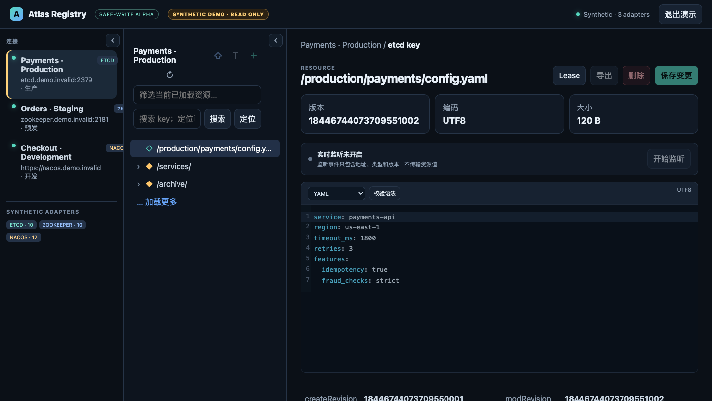

# Atlas Registry

[English](README.md) | **简体中文**

Atlas Registry 是一个跨平台桌面客户端，用统一的资源管理器访问 etcd、ZooKeeper 和 Nacos。它适合日常浏览配置、排查注册信息，以及执行带版本校验和审计记录的受控变更。



_截图由内置的只读演示工作区生成，其中的连接、端点、资源标识、元数据和正文均为合成数据。_

## 下载与安装

前往 [GitHub Releases](https://github.com/caffeine-panic/atlas-registry/releases) 下载对应平台的安装包：

- macOS：DMG
- Windows：MSI 或 NSIS 安装程序
- Linux：DEB、RPM 或 AppImage

应用内可以从标题栏检查更新。更新包会在本地完成签名验证后再安装。

## 主要能力

### 统一资源浏览

- 用三栏资源管理器浏览、搜索和精确定位资源
- 连接栏和资源栏可独立收起、拖动调整宽度，布局会在下次启动时恢复；截断的资源名可悬停查看完整标识
- 分页、懒加载和可取消请求，支持大规模子节点
- Nacos 配置按 50 条翻页，并可跨全部分页模糊搜索 group 或 dataId
- 延迟读取 value，文本与二进制内容均可无损展示
- JSON、YAML、XML、Properties/INI、TOML 配置使用适配深色背景的高对比亮色语法高亮；结构化格式保存前可校验语法
- 监听资源变化，并在断线后按协议能力自动恢复

### 安全变更

- 创建、更新和删除均要求明确确认
- 生产连接默认只读；精确输入连接名后可开启 5–60 分钟的当前会话写入窗口，超时、断开或重启立即恢复只读
- 可将当前资源作为目标，与另一个已连接的同协议环境比较同一精确地址；提升前重新读取两端，确认未过期后进入 Safe Change Center
- 现有资源更新统一进入 Safe Change Center，展示有界 Before/After Diff、权威预检、协议并发令牌、条件提交、权威回读与脱敏收据
- etcd 使用 revision、ZooKeeper 使用 version、Nacos 使用 MD5 或状态指纹进行条件变更
- applied、版本冲突、远端结果未知与审计未完成分别呈现恢复建议；结果不确定时绝不自动重试
- 所有变更写入脱敏审计记录，不记录 value、密码或 token
- 成功和普通状态提示会短暂显示后自动收起；错误、警告及部分成功结果会保留到手动关闭

### 协议原生功能

| 协议      | 原生能力                                                       |
| --------- | -------------------------------------------------------------- |
| etcd      | Lease 创建、绑定、续租、解绑和撤销；2–32 项原子事务            |
| ZooKeeper | ACL 查看与条件编辑；持久、持久顺序、临时和临时顺序节点         |
| Nacos     | 配置历史；namespace、service 和 instance 管理；Nacos 2.x / 3.x |

协议特性不会被强行抹平：通用界面负责连接和资源操作，各协议的原生语义仍通过专用入口呈现。

## 连接与凭据

Atlas Registry 支持：

- etcd 用户名/密码与 TLS
- ZooKeeper Digest 认证与 TLS
- Nacos 用户名/密码、自定义认证上下文或阿里云 MSE AccessKey（AK/SK）

连接配置保存在本机应用目录，密钥保存在系统凭据库。临时密钥只用于当前连接，不写入连接配置。

## 导入、导出与诊断

- 资源导出默认不包含 value；只有显式选择后才会导出正文
- 含 value 的导入计划只在 Rust 进程中短暂保存，并且只能使用一次
- 诊断包只包含运行环境、协议能力和连接数量等聚合信息，不包含连接名称、endpoint、namespace、value 或凭据

## 使用提示

1. 先从标题栏进入“演示”，无需服务端或已保存凭据即可浏览 etcd、ZooKeeper 和 Nacos。
2. 退出只读演示后，新建连接并先执行“测试连接”。
3. 连接成功后，从左侧选择资源，在中间区域浏览层级。
4. 修改或删除前确认当前版本；如果远端已变化，先刷新再决定是否继续。
5. 对生产环境执行写操作前，核对连接名称、目标资源和影响摘要。
6. 遇到“远端结果未知”时先刷新或到服务端核对，不要直接重复提交。

演示工作区与 Tauri IPC、网络、浏览器存储和本机连接配置完全隔离，也可以通过 `?demo=1` 确定性进入；仓库截图流程使用的正是这一入口。

## 本地开发

需要 Node.js、Rust stable、`protoc`，以及对应平台的 Tauri 2 系统依赖。

```bash
npm install
npm run tauri dev
```

提交前运行：

```bash
npm run format:check
npm run lint
npm run test:ui
npm run build
cargo fmt --manifest-path src-tauri/Cargo.toml -- --check
cargo clippy --manifest-path src-tauri/Cargo.toml --all-targets -- -D warnings
cargo test --manifest-path src-tauri/Cargo.toml
```

- 开发流程与代码规范：[CONTRIBUTING.md](CONTRIBUTING.md)
- 整体架构与设计不变量：[docs/ARCHITECTURE.md](docs/ARCHITECTURE.md)
- AI 编码工具协作说明：[AGENTS.md](AGENTS.md)
- 真实服务验证与开发环境：[docs/DEVELOPMENT.md](docs/DEVELOPMENT.md)
- 发布流程：[docs/RELEASING.md](docs/RELEASING.md)
- 安全策略：[SECURITY.md](SECURITY.md)

## 已知限制

- ZooKeeper SASL 尚未支持。
- 单个 value 的内联读取和变更上限为 1 MiB。
- 发布包尚未使用组织级 Apple Developer ID 或 Windows Authenticode 证书；安装前请查看对应 Release 说明。

## License

[MIT](LICENSE)
